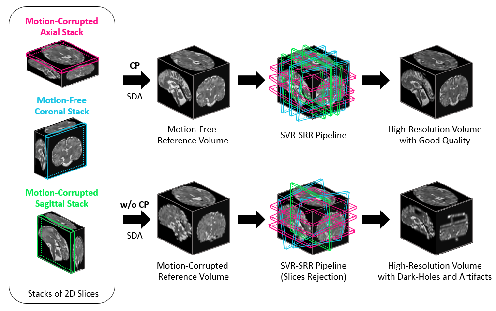
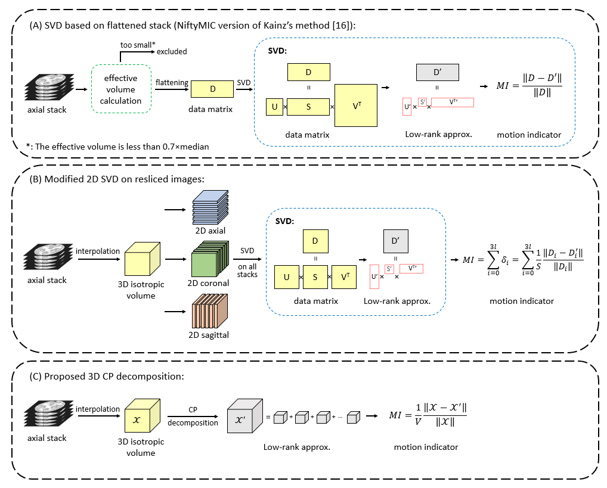

# A Motion Assessment Method for Reference Stack Selection in Fetal Brain MRI Reconstruction Based on Tensor Rank Approximation 
This repository contains relevant code and demo of motion assessment methods using CANDECOMP/PARAFAC (CP) low-rank decomposition and singular value decomposition (SVD), random/linear motion simulation and motion sensitivity test. The concept can be applied to any similar scenario. 
Feel free to contact me (haoanxu@zju.edu.cn) or open an issue if you have any question or comment. 

## Introduction
CP-based motion assessment (MA) is used for quantitative evaluation of motion in different stacks and determining the reference stack with the minimum motion. It can serve as a simple and flexible plug-in to any registration-based motion correction algorithms to improve the volumetric reconstruction quality. It has several merits including:
* **using a tensor low-rank decomposition (CP decomposition) to factorize a 3D stack into low-rank and sparse component** to extract its motion information, which avoids the flattening operations of conventional methods so as not to lose spatial information.
* **interpolating stacks to isotropic** volumes prior to evaluation to reduce the basement bias between stacks in different directions.
* having **higher motion sensitivity** by making full use of 3D information, **lower basement bias** by interpolating before assessment and **higher success rate** of evaluation both in random and linear motion.
* improving the quality and overall success rate of fetal brain super-resolution reconstruction.

   

Figure 1. Illustration of motion assessment. 

## methods comparison
A total of three methods are compared in this work: **CP**, modified SVD method based on re-sliced stacks (**SVD-RSS**) and the conventional SVD method based on flattened stacks (**SVD-FS**). SVD-FS was proposed in the following works:
* [PVR](https://github.com/bkainz/fetalReconstruction) Kainz, Bernhard, et al. "Fast volume reconstruction from motion corrupted stacks of 2D slices."  IEEE Trans Med Imaging. 2015;34(9):1901-1913.
* [NiftyMIC](https://github.com/gift-surg/NiftyMIC) Ebner, Michael, et al. "An automated framework for localization, segmentation and super-resolution reconstruction of fetal brain MRI." NeuroImage 206 (2020): 116324.

   

Figure 2. Workflow of motion assessment methods. 

## Setup
* SimpleITK 1.2.4
* tensorly 0.5.1
* **Further reconstruction:**
* [NiftyMIC v0.9] (https://github.com/gift-surg/NiftyMIC)
* [FMRIB Software Library v6.0] (https://fsl.fmrib.ox.ac.uk/fsl/fslwiki)
